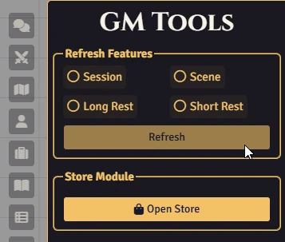
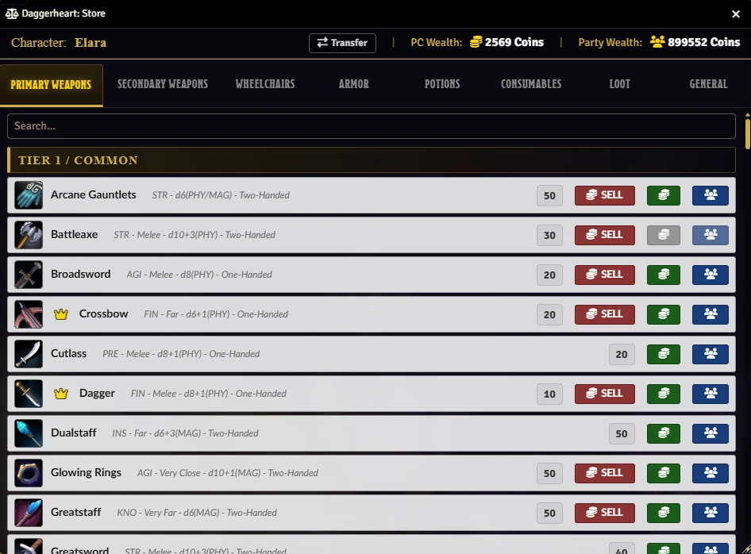
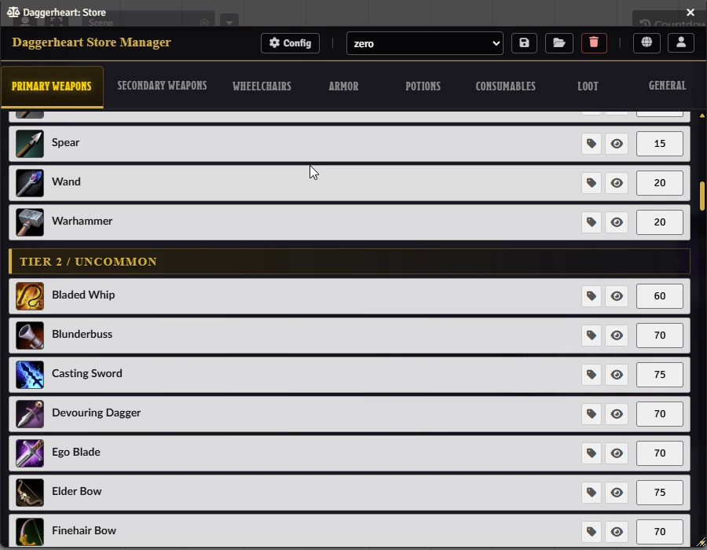

# 🗡️ Daggerheart: Store

A dynamic, interactive, and fully configurable store for the **Daggerheart** system in Foundry VTT. Allow your players to purchase weapons, armor, potions, and miscellaneous items directly from an elegant visual interface, while the GM maintains full control over prices and what is displayed.

## 🌟 Overview & Features

### 🛍️ For Players

* **Intuitive Interface:** Browse categories (Weapons, Armor, Potions, etc.) with organized tabs.

* **Real-Time Search:** Find the desired item instantly by typing its name.

* **Visual Details:** Clear icons, names, and prices. Click on the item image to open the full compendium sheet.

* **Automated Purchase:** Clicking "Buy" automatically deducts currency from the character sheet and adds the item to the inventory.

* **💰 Sell System:** Sell items from your inventory directly to the store. The sell value is configurable by the GM.

* **✨ Auto-Treasure Conversion:** Automatically converts *Handfuls*, *Bags*, and *Chests* into coins when the store is opened, ensuring you always have your liquid cash ready.

* **Party Funds & Split Payment:** If enabled, view Party Wealth and split the cost of purchases between your character's funds and the Party's treasury.

* **Visual & Audio Feedback:** Coin sounds upon purchase/sale and stylized chat messages confirm the transaction.

* **Items on Sale:** Spot discounted items marked with special tags and reduced prices.

### 🛠️ For the Gamemaster (GM)

* **Store Profiles:** Save and load different store configurations (Presets) to quickly switch settings between different towns, merchants, or campaign acts.

* **Total Control:** Open the store for all players or a specific one with a single click using the header buttons.

* **Dynamic Pricing:**

  * **Global Multiplier:** Adjust world inflation (e.g., 50% to 300%) using a slider.

  * **Manual Override:** Change the price of any individual item on the fly, directly within the store interface.

* **Inventory Management:**

  * **Hide Items:** Click the "eye" icon to hide items that shouldn't be available in the current region.

  * **Promotions (Sale):** Mark items as "On Sale" to apply a configurable automatic discount.

  * **Filter by Tier:** Configure which Tiers (1, 2, 3, 4) appear in each category via settings.

* **Customization:**

  * **Party Actor:** Link a Party Actor to the store to enable group purchases.

  * **Custom Compendiums:** Add your own item compendiums (Homebrew) to be scanned by the store.

  * **Custom Tab:** Configure a dedicated tab linked to a specific compendium for special merchant inventories.

  * **System Integration:** Automatically detects the Currency Name defined in your Daggerheart system settings.

## ⚙️ Instructions & Usage

### 🔓 Opening the Store

* **As GM:** Open the store using the "Open Store" button in the Daggerheart menu or via macro `Store.Open()`.

* **As GM:** You also have header buttons to:

  * 🌍 **Show to Everyone:** Opens the store for all connected players.

  * 👤 **Show to Player:** Opens the store only for a selected player.

### 🛠️ Configuration (GM)

Click the gear button (⚙️) in the top-right corner of the store to access advanced settings:

1. **General:** * **Global Price Multiplier:** Adjust base prices globally.

   * **Sale Discount:** Set the percentage off for items on sale.

   * **Sell Ratio:** Define the percentage of value players get back when selling items (e.g., 50%).

   * **Party Actor:** Link a party sheet for shared funds.

2. **Categories:** Toggle visibility of entire categories (e.g., hide "Wheelchairs" or "Guns").

3. **Tiers:** Fine-tune which Tiers are sold in each category (e.g., a village shop only sells Tier 1 items).

4. **Custom Compendiums:** Configure the Custom Tab and merge external compendiums into standard categories.

### 📁 Profiles (Presets)

Use the dropdown menu and header buttons to:

* **Save:** Store the current configuration (prices, hidden items, active tiers) as a new profile.

* **Load:** Instantly apply a saved profile (e.g., "Expensive City", "Goblin Merchant").

* **Delete:** Remove obsolete profiles.

## 💰 Pricing Rules

### 📊 Standard Prices

The loot and consumables are classified as **Common, Uncommon, Rare, and Legendary**, which correspond to **Tier 1, 2, 3, and 4**. Using the table on page 165, the same pricing structure was applied to these items. Weapons and armor are also priced according to this table.

## 🧪 Homebrew & Custom Content

### ➕ Adding Homebrew to the Store

#### 🗂️ Custom Shop Tabs

You can create a dedicated tab with a custom name and specific content. This is useful for special merchants or unique item categories.

1. Create an Item Compendium in your world.

2. Populate the compendium with the items you wish to sell.

3. Open the Shop Configuration menu.

4. Navigate to the **Custom Compendiums** section.

5. Locate the **Custom Tab Compendiums** setting and select the compendium you created.

The items will now be listed in your new custom tab within the shop interface.

#### 🧩 Extending Default Tabs

You can inject new content into the existing standard tabs (e.g., Weapons, Armor) without replacing the core content.

1. Create compendiums and fill them with your custom items.

2. Open the Shop Configuration and go to **Custom Compendiums**.

3. Add one or more compendiums and select the **Target Tab** where each should appear.

## 📸 Screenshots

### 🧑 Player Store View

Clean interface with search, quick buy, sell options, and party fund integration.

### 🎛️ GM View (Editing)

Price controls, hide toggles, sale buttons, and profile management.

## 🚀 Installation

Install via the Foundry VTT Module browser or use this manifest link:

* `https://raw.githubusercontent.com/brunocalado/daggerheart-store/main/module.json`

## ⚖️ Credits and License

* **Code License:** MIT License.

* **Assets:** AI Audio and images provided are [CC0 1.0 Universal Public Domain](https://creativecommons.org/publicdomain/zero/1.0/).

**Disclaimer:** This module is an independent creation and is not affiliated with Darrington Press.

## 🧰 My Daggerheart Modules

### 📦 [daggerheart-extra-content](https://github.com/brunocalado/daggerheart-extra-content)

> Resources for Daggerheart

### 📏 [daggerheart-distances](https://github.com/brunocalado/daggerheart-distances)

> Visualizes Daggerheart combat ranges with customizable rings and hover distance calculations.

### 🛒 [daggerheart-store](https://github.com/brunocalado/daggerheart-store)

> A dynamic, interactive, and fully configurable store for the Daggerheart system in Foundry VTT.

### 😱 [daggerheart-fear-tracker](https://github.com/brunocalado/daggerheart-fear-tracker)

> Adds an animated slider bar with configurable fear tokens to the UI.

### 💀 [daggerheart-death-moves](https://github.com/brunocalado/daggerheart-death-moves)

> Enhances the Death Move moment with immersive audio and visual effects.

### 🤖 [daggerheart-fear-macros](https://github.com/brunocalado/daggerheart-fear-macros)

> Automatically executes macros when the Daggerheart Fear resource is changed.

## 🗺️ Adventures

### 💣 [suicide-squad-daggerheart-adventure](https://github.com/brunocalado/suicide-squad-daggerheart-adventure)

> Torn from your past lives, you are a squad of criminals forced to serve a ruthless master in a land on the brink of war.

### ✨ [i-wish-daggerheart-adventure](https://github.com/brunocalado/i-wish-daggerheart-adventure)

> A wealthy merchant is cursed and running out of time. One final expedition may be the only hope.