# 🗡️ Daggerheart: Store

A dynamic, interactive, and fully configurable store for the **Daggerheart** system in Foundry VTT. Allow your players to purchase weapons, armor, potions, and miscellaneous items directly from an elegant visual interface, while the GM maintains full control over prices and what is displayed.

[](https://buymeacoffee.com/mestredigital) [](https://mestredigital.online/pages/projetos-en)

## 🌟 Overview & Features

### 🛍️ For Players

* **Intuitive Interface:** Browse categories (Weapons, Armor, Potions, etc.) with organized tabs.
* **Real-Time Search:** Find the desired item instantly by typing its name. Clear the search with a single button.
* **Visual Details:** Clear icons, names, and prices. Click on the item image to open the full compendium sheet.
* **Automated Purchase:** Clicking "Buy" automatically deducts currency from the character sheet and adds the item to the inventory.
* **💰 Sell System:** Sell items from your inventory directly to the store, split into "Store Items" (catalog- or GM-priced) and "Other Items — Negotiation Only" (unpriced items, sellable only by proposing your own offer). The sell value is configurable by the GM.
* **🎒 Party Inventory:** Players with Owner permission on the configured Party Actor get a second tab to sell items straight from the party's shared inventory, crediting the party's wealth instead of their own.
* **🤝 Price Negotiations:** Click "Bargain" on a buy or sell item to open a negotiation with the GM — propose an offer, receive counter-offers, and accept or settle in real time, with your funds protected from ending up negative on an accepted deal.
* **✨ Auto-Treasure Conversion:** Automatically converts *Handfuls*, *Bags*, and *Chests* into coins when the store is opened.
* **Party Funds & Split Payment:** View Party Wealth and split the cost of purchases between your character and the Party's treasury.
* **Visual & Audio Feedback:** Coin sounds upon purchase/sale and stylized chat messages confirm the transaction.
* **Items on Sale:** Spot discounted items marked with special tags and reduced prices.
* **Quick Stats:** View essential stats for Weapons (Damage, Range, Trait) and Armor (Score, Thresholds) directly in the list.
* **Smart Recommendations:** Weapons matching your character's highest Trait are highlighted with a gold crown.
* **⭐ Favorites:** Bookmark items to quickly filter and access your wishlist across sessions.
* **Equipment Comparison:** Compare a store item against what you currently have equipped before buying.
* **🧑‍🤝‍🧑 Vendor Identity:** See the merchant's name, portrait, and a tooltip showing your relationship status — colored per level (Hostile/Distrustful/Neutral/Friendly/Allied).

### 🛠️ For the Gamemaster (GM)

* **Store Profiles:** Save and load different store configurations (Presets) to quickly switch between towns, merchants, or campaign acts. Update and rename profiles at any time — Epic item states and Randomizer options are saved per profile.

* **Total Control:** Open the store for all players or a specific one with a single click.

* **Bulk Actions:** One-click buttons to: Mark all items as On Sale or remove them, Show/Hide all items, Enable/Disable purchases for all items, Enable/Disable sales for all items, and **Reset all prices to default**.

* **Dynamic Pricing:**
  * **Global Multiplier:** Adjust world inflation (e.g., 50% to 300%) using a slider.
  * **Manual Override:** Change the price of any individual item on the fly.

* **Price Negotiations:** Toggle player bargaining on/off in Store Config. When a player negotiates, a reactive window opens automatically letting you counter, accept, or reject their offer — deals are blocked from finalizing if the player can no longer afford the agreed price.

* **Inventory Management:**
  * **Visibility Toggle, Block Sales and Block Purchases:** Full per-item control.
  * **Inventory Stock:** Set limited quantities per item. Stock is namespaced per profile — no data collisions when multiple profiles share the same Party Actor.
  * **Promotions (Sale):** Mark items as "On Sale" to apply a configurable automatic discount.
  * **Filter by Tier:** Configure which Tiers (1, 2, 3, 4) appear in each category via settings.
  * **Block from Randomizer:** Lock specific items so they are never replaced by random generation.
  * **Epic Items:** Flag items as Epic with distinct visual effects; state is saved per profile.

* **Vendor Identity:**
  * **Vendor Tab:** Configure the merchant's name, portrait (FilePicker), and a description shown as an in-store tooltip.
  * **Per-Character Relationships:** Set each player character's relationship level (Hostile → Allied) with configurable price modifiers applied after all other pricing transformations.

* **Item Tag Editor:** Edit item metadata (price, tier, header) directly from within the store using Foundry item flags — no manual description editing required.

* **Customization:**
  * **Party Actor:** Link a Party Actor to enable group purchases.
  * **Custom Compendiums:** Add homebrew compendiums to the store. Disable SRD compendiums to streamline pure-homebrew setups.
  * **Custom Tab:** Dedicate a tab to one or more specific compendiums for special merchant inventories.
  * **System Integration:** Automatically detects the Currency Name defined in your Daggerheart system settings.
  * **Import / Export:** Share your store profile configuration across worlds or with other GMs.

* **Store Randomizer:** Generate dynamic inventory per category with configurable parameters. Includes a shortcut to restore maximum item counts. Options saved per profile.

## 📖 Learn More

This page covers *what* the module does. For *how* to set it up — linking player characters, opening the store, configuring prices, profiles, and homebrew content — check the full guide:

**➡️ [docs/WIKI.md](docs/WIKI.md)**

## 💰 Pricing Rules

### 📊 Standard Prices

The loot and consumables are classified as **Common, Uncommon, Rare, and Legendary**, which correspond to **Tier 1, 2, 3, and 4**. Using the table on page 165, the same pricing structure was applied to these items. Weapons and armor are also priced according to this table.

## 📸 Screenshots

### 🧑 Player Store View

Clean interface with search, quick buy, sell options, and party fund integration.

<p align="center">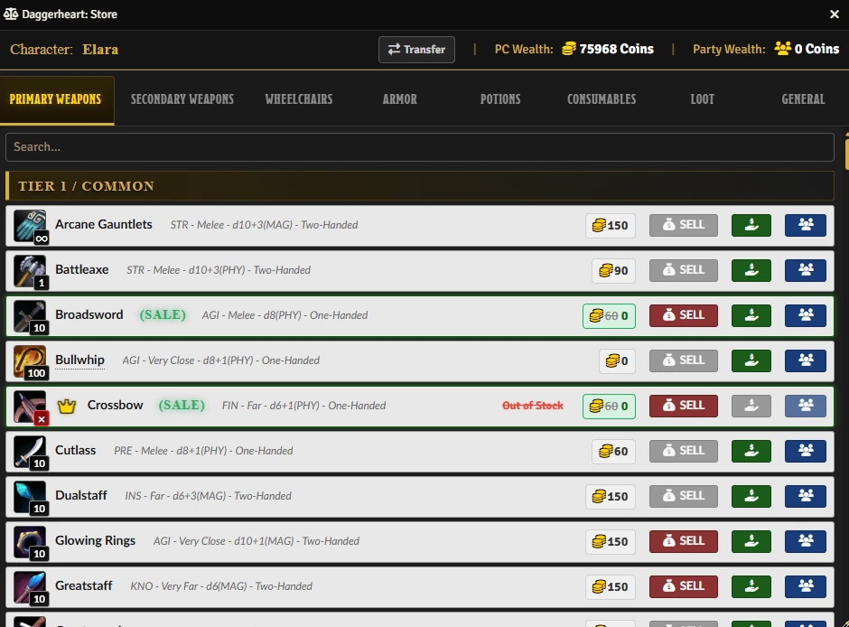</p>

Selling from your personal inventory — "Store Items" priced by the GM and "Other Items" available for negotiation only.

<p align="center">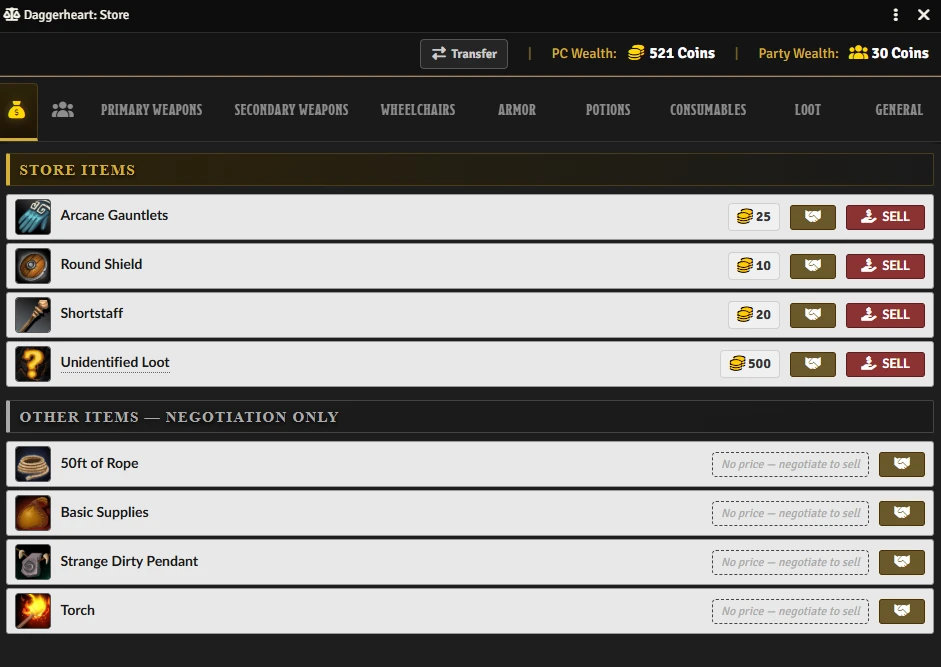</p>

Players with Owner permission on the Party Actor can sell straight from the shared Party Inventory tab.

<p align="center">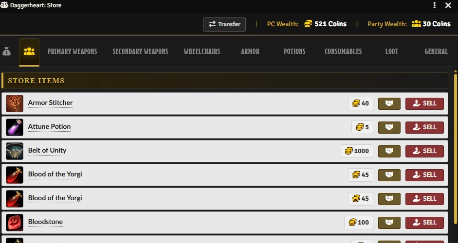</p>

Comparing a store item against what your character currently has equipped before buying.

<p align="center">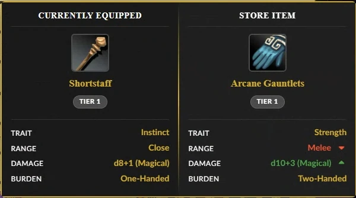</p>

Price negotiations in action — propose an offer, receive a counter-offer, and settle in real time.

<p align="center">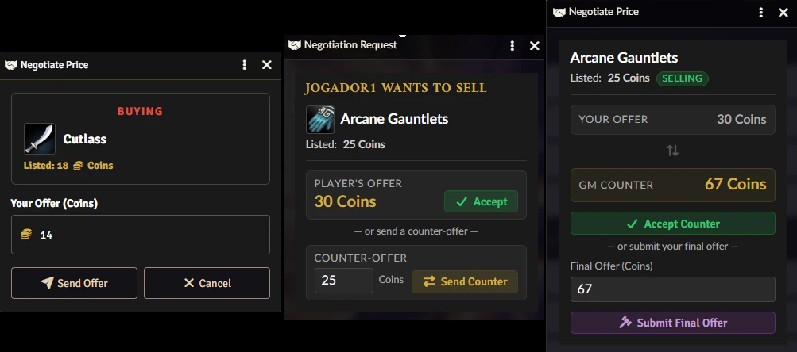</p>

### 🎛️ GM View (Editing)

Price controls, hide toggles, sale buttons, and profile management.

<p align="center">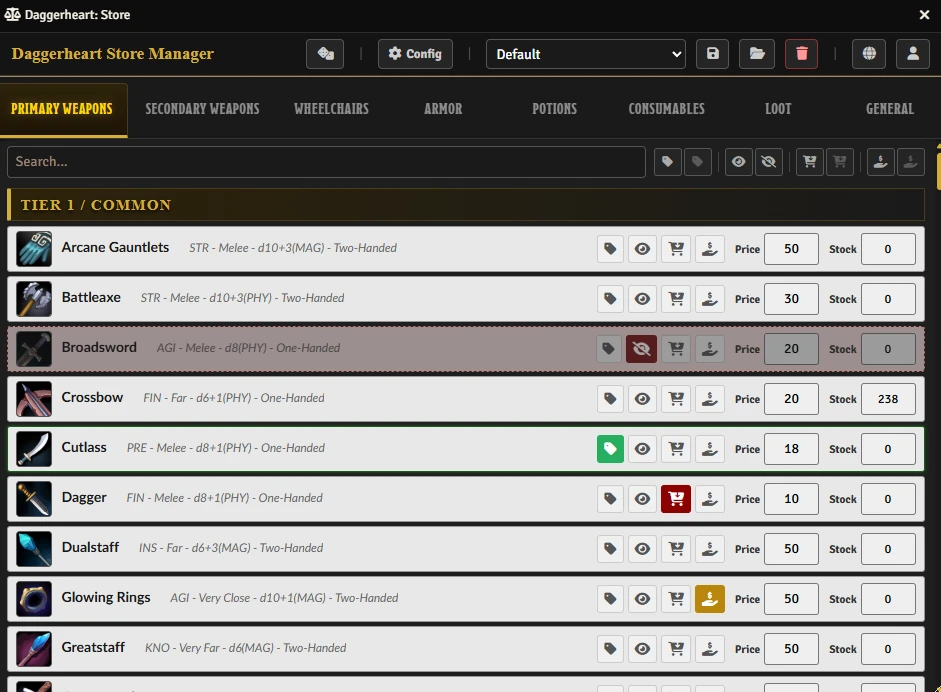</p>

<p align="center">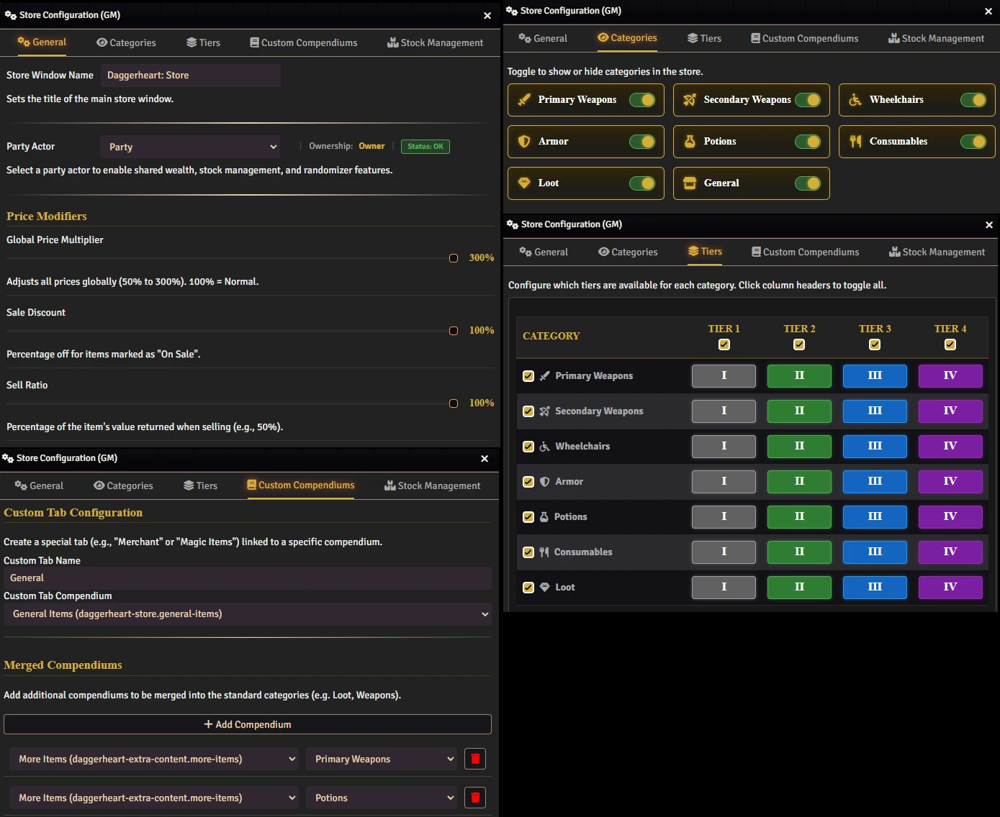</p>

<p align="center">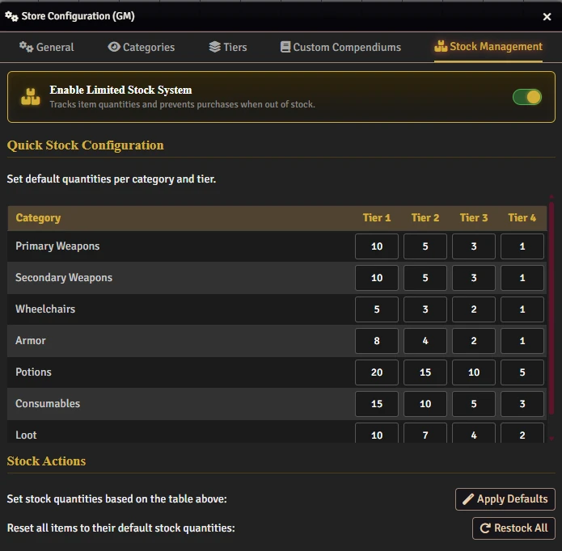</p>

<p align="center">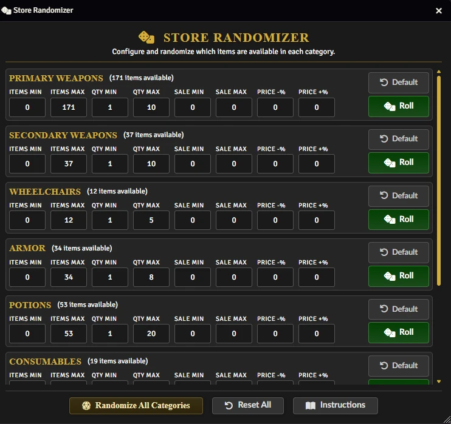</p>

Save, load, and manage Store Profiles to quickly switch between towns, merchants, or campaign acts.

<p align="center">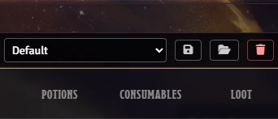</p>

Add homebrew compendiums or create a dedicated Custom Tab for special merchant inventories.

<p align="center">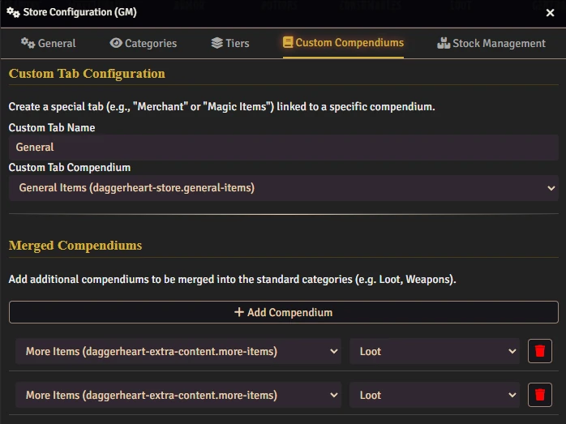</p>

## 🚀 Installation

Install via the Foundry VTT Module browser or use this manifest link:

```
https://raw.githubusercontent.com/brunocalado/daggerheart-store/main/module.json
```

## ⚖️ Credits and License

* **Code License:** GNU GPLv3.

* **epic.mp3 and coins.mp3** [Zapsplat](https://www.zapsplat.com). The audio assets are used in accordance with the Zapsplat Standard License.

**Disclaimer:** This module is an independent creation and is not affiliated with Darrington Press.

# 🧰 My Daggerheart Modules

| Module | Description |
| :--- | :--- |
| 💀 [**Adversary Manager**](https://github.com/brunocalado/daggerheart-advmanager) | Scale adversaries instantly and build balanced encounters. |
| 🖼️ [**Art Mapper**](https://github.com/brunocalado/dh-assets) | Automatically assigns artwork to system compendiums, actors, tokens, and custom module content — keeping your visuals organized and up to date. |
| 🐉 [**Colossus**](https://github.com/brunocalado/dh-colossus) | Manage massive multi-part boss encounters with independent HP per part and a single shared stress pool. |
| 📦 [**Containers**](https://github.com/brunocalado/dh-containers) | Group inventory items into collapsible containers — pouches, chests, backpacks — to declutter character sheets. |
| 💥 [**Critical**](https://github.com/brunocalado/daggerheart-critical) | Animated criticals. |
| 💠 [**Custom Stat Tracker**](https://github.com/brunocalado/dh-new-stat-tracker) | Add custom trackers to actors. |
| ☠️ [**Death Moves**](https://github.com/brunocalado/daggerheart-death-moves) | Enhances the Death Move moment with a dramatic interface and full automation. |
| 📏 [**Distances**](https://github.com/brunocalado/daggerheart-distances) | Visualizes combat ranges with customizable rings and hover calculations. |
| 📦 [**Extra Content**](https://github.com/brunocalado/daggerheart-extra-content) | Homebrew content pack. |
| 😱 [**Fear Tracker**](https://github.com/brunocalado/daggerheart-fear-tracker) | Adds an animated slider bar with configurable fear tokens to the UI. |
| 🧟 [**Horde**](https://github.com/brunocalado/dh-horde) | Explode single horde tokens into dozens of individual tokens and manage their movement and stats automatically. |
| 🎁 [**Mystery Box**](https://github.com/brunocalado/dh-mystery-box) | Introduces mystery box mechanics for random loot and surprises. |
| ⚡ [**Quick Actions**](https://github.com/brunocalado/daggerheart-quickactions) | Quick access to common mechanics like Falling Damage, Downtime, etc. |
| 📜 [**Quick Rules**](https://github.com/brunocalado/daggerheart-quickrules) | Fast and accessible reference guide for the core rules. |
| 🤖 [**Resource Macros**](https://github.com/brunocalado/daggerheart-fear-macros) | Automatically executes macros when the Fear or Hope resources change. |
| 🎲 [**Stats**](https://github.com/brunocalado/daggerheart-stats) | Tracks dice rolls from GM and Players. |
| 🧠 [**Stats Toolbox**](https://github.com/brunocalado/dh-statblock-importer) | Import actors using a statblock. |
| 🛒 [**Store**](https://github.com/brunocalado/daggerheart-store) | A dynamic, interactive, and fully configurable in-game store. |
| 🔍 [**Unidentified**](https://github.com/brunocalado/dh-unidentified) | Obfuscates item names and descriptions until they are identified by the players. |
| 🌌 [**Void**](https://github.com/brunocalado/the-void-unofficial) | Unofficial module that brings The Void playtesting content — experimental classes, subclasses, ancestries, communities, adversaries, loot, weapons, and more. |

# 🗺️ Adventures

| Adventure | Description |
| :--- | :--- |
| ✨ [**I Wish**](https://github.com/brunocalado/i-wish-daggerheart-adventure) | A wealthy merchant is cursed; one final expedition may be the only hope. |
| 💣 [**Suicide Squad**](https://github.com/brunocalado/suicide-squad-daggerheart-adventure) | Criminals forced to serve a ruthless master in a land on the brink of war. |
